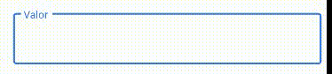

# currency_text_input_mask

A Controller with mask for currency text input, basead on the currency_textfield package.



## Usage

Import the library

```dart
import 'package:currency_text_input_mask/currency_text_input_mask.dart';
```

Create the Controller
```dart
CurrencyTextInputMaskController controller = CurrencyTextInputMaskController()
```

### Currency Symbol, Decimal and Thousand separator

It's possible to customize `leftSymbol`, `decimal` and `thousand` separators:

```dart
var controller = CurrencyTextInputMaskController(leftSymbol: "R\$", decimalSymbol: ".", thousandSymbol: ",");
```

### Get double value

To get the number value from controller, use the `doubleValue` property:

```dart
final double val = controller.doubleValue;
```


